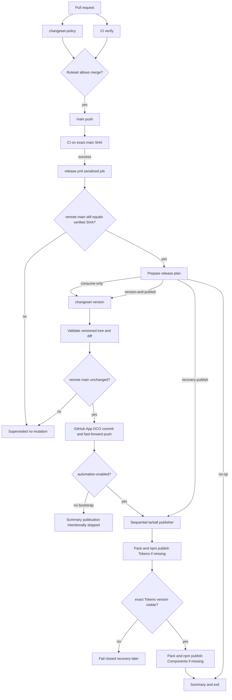

# RFC：ExUI 合入即发布的 npm 自动化

## 状态

- 状态：Draft for implementation review
- 创建日期：2026-09-01
- 决策负责人：`wojzj57`
- 独立审核人：`Xiamolc007`
- 来源规格：[Automated npm Release Design](../specs/2026-08-31-automated-npm-release-design.md)
- RFC 目录：`notes/automated-npm-release/rfcs/`

## 决策摘要

ExUI 将使用受保护的 `main`、强制 Changeset 检查和一个串行的 `release.yml` 工作流，实现“带发布意图的 PR 合入并通过 `main` CI 后，立即升版、提交并发布 npm”。

Changesets 负责解析和消费 `.changeset/*.md`、计算版本、更新内部依赖与 Changelog；发布器不调用 `changeset publish`，而是按依赖顺序用 `pnpm pack` 生成 tarball，再用 npm CLI 通过 OIDC 串行执行 `npm publish <tarball>`。先确认 `@exre/exui-tokens@version` 在官方 Registry 可见，才允许发布依赖它的 `@exre/exui@version`。

版本提交必须先以 fast-forward 方式写入 `main`，npm 发布才可开始。发布提交成功但 npm 失败时，不回滚或再次升版；后续运行按精确 `package@version` 状态补发缺失包。

## 来源规格与仓库证据修正

来源规格中的目标、权限边界、首次 `0.1.0`、自动合批、OIDC、失败恢复和不发布 Showcase 等决策保持不变。RFC 核实仓库后记录两项实现级修正：

1. 当前 `.changeset/` 已包含：
   - `component-recipes.md`：`@exre/exui-tokens` minor；
   - `exui-tokens-commonjs-entry.md`：`@exre/exui-tokens` minor；
   - `component-recipe-styles.md`：`@exre/exui` patch；
   - `initialize-version-management.md`：empty Changeset。
2. 当前 `changeset status` 计算结果是 Tokens `0.1.0`、Components `0.0.1`。因此仍需新增一个 Components minor Changeset，才能满足已批准的两个包首次都发布为 `0.1.0`。

来源规格把 `changeset publish` 作为发布实现，但已安装的 `@changesets/cli@2.31.0` 会通过 `Promise.all` 并发发布未发布包，不能兑现已批准的 Tokens-before-Components 顺序。用户已批准由本 RFC 将发布边界修正为：

- Changesets：版本计划、版本写入、Changelog、Changeset 消费；
- pnpm：从 workspace 源生成已解析 `workspace:*` 的 tarball；
- npm CLI：通过官方支持的 OIDC Trusted Publishing 串行发布 tarball。

该修正不改变产品行为或发布时机，只使依赖顺序和认证契约可验证。

## 背景与问题

仓库是一个私有 pnpm workspace：

- `packages/tokens` 是公开包 `@exre/exui-tokens`；
- `packages/components` 是公开包 `@exre/exui`，依赖 Tokens；
- `packages/showcase` 和根 workspace 是私有包。

现有 `.github/workflows/ci.yml` 在 PR 和 `main` push 上使用 Windows runner，运行 Token 校验、类型检查、Lint、视觉测试、构建和 tarball 消费者验证。最近 CI 因 `packages/tokens/src/style.css` 与生成器结果不一致而失败。

当前 GitHub 组织套餐不能保护私有仓库 `main`；升级 GitHub Team 是启用自动发布的外部前置条件。当前 npm 官方 Registry 不存在两个公开包，而 Trusted Publisher 只能配置到已存在的包；首次 `0.1.0` 必须人工使用 2FA 发布。

本决策的主要难点不是调用发布命令，而是同时保证：

- `main` 对人类写入严格保护；
- release bot 只有最小、可审计的例外；
- 只发布经过 `main` CI 验证的提交；
- 版本提交与 npm 不可变版本保持一一对应；
- 连续合并、部分发布和 Registry 故障不会产生重复版本或错误覆盖；
- workspace tarball 依赖已解析，OIDC 又走 npm 官方支持路径。

## 目标

1. PR 修改任一公开包时，必须显式提交普通或 empty Changeset。
2. `main` 禁止人类直接 push、force push 和删除。
3. 每个发布任务只接受一个仍为远端 `main` 头部的、已通过 CI 的 SHA。
4. 所有待处理 Changesets 可以自动合批，但每个 Changeset 只能消费一次。
5. Changesets 只修改两个公开包的版本、内部依赖、Changelog 和待消费文件。
6. 发布提交通过专用 GitHub App fast-forward 写入 `main`，并包含 DCO sign-off。
7. npm 发布使用官方 Registry、GitHub-hosted runner 和 OIDC，不保存 npm 写 Token。
8. Tokens 与 Components 的首次版本都是 `0.1.0`，以后独立升版。
9. 部分发布或重跑时，只补发 Registry 明确不存在的精确版本。
10. 本地验证、仓库实现验收、首次人工发布和首次真实 OIDC 发布分别形成独立证据门。

## 非目标

- 不创建 Version PR。
- 不为常规自动发布增加人工审批。
- 不固定两个公开包的后续版本一致。
- 不发布根 workspace 或 Showcase。
- 不从 self-hosted runner 发布。
- 不以 npm Token 作为 OIDC 回退。
- 第一版不推送远程 Git Tag，也不创建 GitHub Release。
- 不修改公开组件 API 或 Token 语义。
- 不把 npm 私有仓库 provenance 当作已具备能力。

## 约束

| 约束 | 来源或理由 |
| --- | --- |
| pnpm 固定为 11.9.0 | 根 `packageManager` |
| Node 固定主版本 24 | 现有 CI |
| npm CLI 必须至少 11.5.1 | npm Trusted Publishing 的 OIDC 要求 |
| CI 视觉基线继续使用 Windows | 现有注释声明 Chromium 字体光栅化与平台相关 |
| 公开包版本独立 | `.changeset/config.json` 的 `fixed` 与 `linked` 均为空 |
| 私有包不升版、不打 Tag | `privatePackages.version=false`、`tag=false` |
| Registry 固定为 `https://registry.npmjs.org/` | 防止开发机腾讯镜像或其他配置重定向发布 |
| 自动提交必须 DCO | `CONTRIBUTING.md` |
| 生成 CSS 只能通过现有生成器更新 | `AGENTS.md` |
| npm 版本不可覆盖 | npm Registry 语义 |

## 总体架构



两个工作流只有单向依赖：`CI` 产生可信 SHA，`Release` 消费可信 SHA。Release 不复用 PR 工作目录，不接受 PR artifact，也不从事件负载执行任意命令。

## 目录与文件边界

| 路径 | 责任 | 变更类型 |
| --- | --- | --- |
| `.github/workflows/ci.yml` | PR/`main` 验证与 Changeset 必需检查 | 修改 |
| `.github/workflows/release.yml` | 可信触发、权限、并发、版本提交、发布编排 | 新增 |
| `.github/CODEOWNERS` | 发布关键路径所有权 | 新增 |
| `scripts/changeset-policy.mjs` | PR diff 与 Changeset 策略 | 新增 |
| `scripts/release/plan.mjs` | Changeset 状态、模式、允许写入集合和发布计划 | 新增 |
| `scripts/release/registry-status.mjs` | 官方 Registry 精确版本分类 | 新增 |
| `scripts/release/publish.mjs` | tarball 校验与依赖拓扑串行发布 | 新增 |
| `scripts/package-contract.mjs` | `verify:pack` 与发布器共享的 tarball manifest 合约 | 新增 |
| `scripts/release/*.test.mjs` | 纯逻辑与故障路径测试 | 新增 |
| `TESTING.md` | 测试布局和命令 | 新增 |
| `package.json` | `changeset:check`、`test:release` 等脚本 | 修改 |
| `packages/tokens/package.json` | repository 与官方 Registry 元数据 | 修改 |
| `packages/components/package.json` | repository 与官方 Registry 元数据 | 修改 |
| `packages/tokens/src/style.css` | 由生成器修复过期产物 | 生成更新 |
| `.changeset/initial-exui-components-release.md` | Components 首次 minor 发布意图 | 新增 |

不编辑 `dist/` 或 `types/`。不修改现有用户/代理在其他 `notes/` 路径中的内容。

## CI 契约

### `verify` job

保留现有 `windows-latest`、30 分钟 timeout 和命令顺序：

1. checkout；
2. pnpm 11.9.0；
3. Node 24；
4. `pnpm install --frozen-lockfile`；
5. Playwright Chromium cache/install；
6. `pnpm tokens:check`；
7. `pnpm typecheck`；
8. `pnpm lint`；
9. `pnpm test:visual`；
10. `pnpm build`；
11. `pnpm verify:pack`；
12. `pnpm test:release`。

修复 Token CSS 时运行正式生成器并提交生成结果；不得删除 `--check`、改变生成源或把失败改成 warning。

### `changeset-policy` job

只在 `pull_request` 事件执行策略判断；在 `push` 事件保留同名成功 job，避免必需检查上下文出现歧义。Ruleset 中登记的唯一 job check 名称是 `verify` 与 `changeset-policy`。

checkout 必须获取 PR base/head 比较所需历史。调用契约：

```text
node scripts/changeset-policy.mjs --base <base-sha> --head <head-sha>
```

退出码：

- `0`：策略满足或本 PR 不触发公开包策略；
- `1`：可操作的策略违反，例如缺 Changeset、非法包名或非法 bump；
- `2`：Git、Changesets 或输入状态不可判定。

标准输出只包含简短结论；失败细节写入 GitHub step summary。脚本不得输出 Changeset 全文或环境变量。

判断规则：

1. 用 `git diff --name-status <base>...<head>` 获取 PR 自身差异。
2. 修改 `packages/tokens/**` 或 `packages/components/**` 时，PR 必须新增至少一个 `.changeset/*.md`。
3. 使用 `pnpm exec changeset status --since=<base> --output=<runner-temp>` 解析 PR 自身计划。
4. 普通 Changeset 只允许 `@exre/exui-tokens` 和 `@exre/exui`，bump 只允许 patch/minor/major。
5. empty Changeset 必须是空 release 数组，不能伪装包选择。
6. 仅修改根编排、`.github`、`notes`、`skills` 或 Showcase 时不要求 Changeset。
7. 删除或重命名公开包路径仍视为公开包变更。

## 发布触发与权限契约

`release.yml` 在 workflow 顶层声明 `permissions: {}`。发布 job 只声明：

- `contents: read`；
- `id-token: write`。

触发器：

- `workflow_run`：只接受 workflow 名 `CI`、事件 `push`、结论 `success`、head branch `main`、仓库 `caep-dev/exui`；
- `workflow_dispatch`：只接受 `refs/heads/main`，并在计划前完整执行仓库验证。

并发：

```text
group: exui-main-release
cancel-in-progress: false
```

Release checkout 使用只读 `GITHUB_TOKEN` 且 `persist-credentials: false`。GitHub App Token 只在版本树通过验证且第二次 head compare 成功后创建：

- Action：`actions/create-github-app-token@v3`；
- 变量：`EXUI_RELEASE_APP_ID`；
- Environment secret：`EXUI_RELEASE_APP_PRIVATE_KEY`；
- token input：`permission-contents: write`；
- 默认仅当前仓库，不传组织级 repository 集合；
- job 结束时由 Action 撤销 token。

App token push 会触发 release commit 自己的 CI；禁止改用 `GITHUB_TOKEN` push，因为该 token 产生的 push 不会再次触发 workflow。

## Release Plan 契约

调用：

```text
node scripts/release/plan.mjs --expected-head <sha> --output <runner-temp>/release-plan.json
```

脚本执行：

1. 确认 worktree 干净。
2. `git fetch origin main`。
3. 比较 `refs/remotes/origin/main` 与 `--expected-head`。
4. 在 runner 临时目录运行 `changeset status --output`。
5. 校验 release 中仅有两个公开包；Showcase 的 `type: none` 可忽略，任何其他包名失败。
6. 根据 Changeset 列表和 Registry 精确版本状态选择模式。
7. 对 `version-and-publish` 或 `consume-only` 运行 `pnpm version-packages`。
8. 重新读取两个公开包 manifest，产生版本后计划。
9. 验证工作树 diff 只落在允许集合。
10. 原子写出计划 JSON；失败不留下部分计划。

计划格式：

```json
{
  "schemaVersion": 1,
  "expectedHead": "<40-char-sha>",
  "mode": "version-and-publish",
  "changesets": ["component-recipes"],
  "releases": [
    {
      "name": "@exre/exui-tokens",
      "workspace": "packages/tokens",
      "oldVersion": "0.0.0",
      "newVersion": "0.1.0",
      "type": "minor",
      "dependsOn": []
    }
  ],
  "allowedDiff": [
    ".changeset/component-recipes.md",
    "packages/tokens/package.json",
    "packages/tokens/CHANGELOG.md"
  ]
}
```

`mode` 只能是：

- `version-and-publish`：至少一个非 empty Changeset；
- `consume-only`：有 Changeset，但全部为 empty；
- `recovery-publish`：没有 Changeset，当前 manifest 至少一个精确版本在 Registry 明确不存在；
- `no-op`：没有 Changeset，两个当前版本都已发布。

`consume-only` 运行 `pnpm version-packages` 后必须断言 package.json 与 Changelog 均未修改，允许 diff 只能是 empty Changeset 删除。其提交标题是 `chore(release): consume empty changesets`，并且发布步骤无条件跳过。

## 版本树验证与提交契约

`version-and-publish` 在 commit 前运行：

```text
pnpm install --frozen-lockfile
pnpm tokens:check
pnpm typecheck
pnpm lint
pnpm build
pnpm verify:pack
pnpm test:release
```

PR 的 Windows CI 已执行视觉测试。版本步骤只改变 manifest、Changelog 和 Changeset，因此 release job 不重复视觉测试；`workflow_dispatch` 在计划前执行完整 `verify`，其中包含视觉测试。

允许写入集合：

- 被消费的 `.changeset/*.md` 删除；
- `packages/tokens/package.json`；
- `packages/tokens/CHANGELOG.md`；
- `packages/components/package.json`；
- `packages/components/CHANGELOG.md`。

只有实际被 Changesets 修改的路径才能 stage。`pnpm-lock.yaml` 不应因 workspace 自身版本变化而修改；若 frozen install 报告 lockfile 不匹配，发布失败并通过普通 PR 修复，不在 release job 自动重写。

commit 前再次 fetch 和 compare 远端 `main`。不相等时：

- 删除临时计划；
- 丢弃 ephemeral runner 中的生成 diff；
- 在 summary 标记 `superseded`；
- 以成功但未发布状态退出；
- 不 rebase、不 force push。

GitHub App 身份从 Action 输出的 `app-slug` 和 GitHub API 返回的 bot user ID 动态构造：

```text
<app-slug>[bot] <<bot-user-id>+<app-slug>[bot]@users.noreply.github.com>
```

`version-and-publish` 提交：

```text
chore(release): publish packages

Signed-off-by: <dynamic GitHub App bot identity>
```

使用显式 pathspec stage，并执行普通 fast-forward `git push origin HEAD:main`。push 失败不得重试为 force push；远端已前进时按 superseded 处理，其他错误失败。

Git 认证通过设置 masked `GH_TOKEN` 后运行 `gh auth setup-git`，不把 installation token 拼进 remote URL、命令参数或 summary。job 结束时清理临时 Git credential 配置，并由 App Token Action 撤销 token。

## Registry 状态契约

`registry-status.mjs` 使用 Node 24 `fetch` 直接查询：

```text
https://registry.npmjs.org/<percent-encoded-package>/<exact-version>
```

分类：

| HTTP/运行结果 | 分类 | 行为 |
| --- | --- | --- |
| 200 且响应 name/version 完全匹配 | `published` | 跳过发布 |
| 404 | `absent` | 允许发布 |
| 401/403 | `indeterminate` | 失败，不发布 |
| 429/5xx | `indeterminate` | 有界重试后失败 |
| timeout、DNS、TLS、JSON 错误 | `indeterminate` | 有界重试后失败 |
| 200 但 name/version 不匹配 | `indeterminate` | 失败，不发布 |

每次请求 timeout 15 秒；429、5xx 和网络错误最多再试一次，等待 5 秒。重试参数是实现常量，并由假时钟测试覆盖。发布授权只来自最终的 `absent`；任何不确定状态都失败关闭。

## Tarball 与串行发布契约

`publish.mjs` 只接受 `release-plan.json`，且要求 worktree HEAD 等于计划对应的发布 commit。调用：

```text
node scripts/release/publish.mjs --plan <runner-temp>/release-plan.json
```

发布顺序从 manifest 依赖图计算，不能依赖 Changesets 输出顺序。当前唯一合法拓扑是：

1. `@exre/exui-tokens`；
2. `@exre/exui`。

每个待发布包：

1. 通过 Registry checker 查询精确版本。
2. `published`：记录 skipped，不运行 publish。
3. `absent`：在 runner 临时目录执行该 workspace 的 `pnpm pack --json --pack-destination <temp>`。
4. 读取 tarball 内 `package/package.json`，验证：
   - name 与计划完全一致；
   - version 与计划或恢复 manifest 完全一致；
   - `private` 不是 true；
   - `publishConfig.access` 为 public；
   - `publishConfig.registry` 为官方 Registry；
   - 不存在任何 `workspace:` 依赖；
   - Components 对 Tokens 的依赖等于当前 Tokens manifest 版本。
5. 验证通过后执行：

```text
npm publish <absolute-tarball-path> --access public --registry=https://registry.npmjs.org/
```

6. 发布命令使用 setup-node 提供的 npm。启动前检查 Node >=22.14.0 且 npm >=11.5.1，不满足则失败，不在线升级工具链。
7. npm 命令成功后轮询 Registry 精确版本，最多 6 次、每次间隔 5 秒。
8. Tokens 未确认 `published` 前，Components 不得开始。

若 `npm publish` 返回非零，脚本再查询一次精确版本：

- 已可见：记录“publish command nonzero but Registry confirms published”，继续；
- 明确不存在或不可判定：失败，等待恢复运行。

脚本不设置 `NODE_AUTH_TOKEN`，不调用 `npm whoami`，不读取或打印 npm 用户身份。OIDC 失败不得切换 credential。

`changeset publish` 不参与发布，因为它在当前版本中并发发布包，并会创建本轮不需要的本地 Tag。

上述 tarball manifest 断言由 `scripts/package-contract.mjs` 提供纯函数；`scripts/verify-packages.mjs` 与 `scripts/release/publish.mjs` 必须调用同一实现。发布器只增加发布顺序、Registry 状态和命令编排，不复制 package 合约。

## 包元数据契约

两个公开 manifest 都新增：

```json
{
  "repository": {
    "type": "git",
    "url": "https://github.com/caep-dev/exui.git"
  },
  "publishConfig": {
    "access": "public",
    "registry": "https://registry.npmjs.org/"
  }
}
```

`repository.url` 必须与 npm Trusted Publisher 的 GitHub repository 精确对应。根 manifest 和 Showcase 不增加发布配置。

`scripts/verify-packages.mjs` 扩展 tarball 断言，验证上述字段、版本一致性和 Components 的已解析 Tokens 依赖。

## 分支保护与 CODEOWNERS

升级 GitHub Team 后，`main` Ruleset 配置：

1. 必须通过 PR；
2. 至少 1 个批准；
3. 必须通过 `verify` 和 `changeset-policy`；
4. 合并前必须基于最新 `main`；
5. 必须解决全部 review conversation；
6. 要求线性历史；
7. 禁止 force push 和删除；
8. 管理员无通用 bypass；
9. 专用 ExUI Release GitHub App 是唯一 `always` bypass actor。

先把 `Xiamolc007` 从 read 提升到 write。`.github/CODEOWNERS` 至少包含：

```text
/.github/workflows/ci.yml @wojzj57 @Xiamolc007
/.github/workflows/release.yml @wojzj57 @Xiamolc007
/.github/CODEOWNERS @wojzj57 @Xiamolc007
/.changeset/config.json @wojzj57 @Xiamolc007
/package.json @wojzj57 @Xiamolc007
/scripts/changeset-policy.mjs @wojzj57 @Xiamolc007
/scripts/release/ @wojzj57 @Xiamolc007
/packages/tokens/package.json @wojzj57 @Xiamolc007
/packages/components/package.json @wojzj57 @Xiamolc007
```

Ruleset 要求 Code Owner review。GitHub App 只安装在 `caep-dev/exui`，repository permission 只有 Contents write。

## npm Trusted Publisher 与 bootstrap

Environment 名固定为 `npm-release`，只允许 `main` 部署，不设置 required reviewer。两个包的 Trusted Publisher 都绑定：

- organization/user：`caep-dev`；
- repository：`exui`；
- workflow：`release.yml`；
- environment：`npm-release`；
- allowed action：direct `npm publish`。

Repository variable `NPM_RELEASE_AUTOMATION_ENABLED` 初始不存在或为字符串 `false`。只有严格等于 `true` 才能进入 publish。

首次上线顺序：

1. 升级 `caep-dev` 到 GitHub Team。
2. 把 `Xiamolc007` 提升为 write。
3. 由维护者在不向日志或聊天暴露身份凭据的前提下，确认 npm `@exre` scope 已存在且当前 2FA 账户具备创建这两个公开包的权限；验证失败则停止 rollout。
4. 创建专用 GitHub App，安装到单仓库并配置唯一 Ruleset bypass。
5. 创建 `npm-release` Environment，写入 App private key secret；设置 App ID variable。
6. 保持 `NPM_RELEASE_AUTOMATION_ENABLED=false`。
7. 实现 PR 新增 Components minor Changeset；现有 patch、两个 Token minor 和 empty Changeset 保留。
8. PR 通过并合入后，release job 生成两个 `0.1.0` 和 Changelog，提交版本，但明确跳过 npm。
9. 暂停新的 release-bearing PR 合并。
10. 维护者从精确 release commit 构建并验证 tarball，使用 npm 2FA 对两个 `0.1.0` 做唯一一次人工发布；顺序仍为 Tokens 后 Components。
11. 从官方 Registry 验证两个精确版本。
12. 在 npm 为两个包配置 Trusted Publisher。
13. 设置 `NPM_RELEASE_AUTOMATION_ENABLED=true`。
14. 恢复合并。

人工发布不得使用长期 automation token。首次 `0.1.0` 完成后，后续版本只能走 OIDC。

## 状态机与故障语义

| 状态 | 进入条件 | 允许动作 | 终态 |
| --- | --- | --- | --- |
| `unverified` | workflow 启动 | 检查事件与 CI | reject 或 verified |
| `verified` | 精确 SHA 已通过 CI | 计划、Registry 查询 | planned/superseded |
| `planned` | 计划合法 | version/consume 或 recovery | validated/no-op |
| `validated` | 版本树和 diff 合法 | 二次 head compare | superseded/committed |
| `committed` | fast-forward push 成功 | publish 或 bootstrap skip | publishing/skipped |
| `publishing` | automation=true | 串行发布 | published/failed-partial |
| `failed-partial` | 至少一个包可能已发布 | 不回滚，等待精确状态恢复 | 后续 recovery |
| `published` | 所有计划版本 Registry 可见 | summary | success |

关键故障：

- 计划/验证失败：没有 commit，没有 npm 变更。
- head 已前进：superseded，不合并未验证代码，不报发布成功。
- commit 失败：不发布。
- commit 成功、OIDC 失败：版本 commit 保留；release commit 自己的 CI 成功后进入 recovery。
- Tokens 成功、Components 失败：恢复运行跳过 Tokens，只补 Components。
- Registry 不可判定：失败关闭。
- 已发布包有缺陷：新建 Changeset 发布更高版本，不覆盖、不降版。

## 安全与信任边界

### 信任主体

- 人类维护者：通过 PR、review 和 2FA bootstrap。
- GitHub Actions `GITHUB_TOKEN`：只读源码、申请 OIDC。
- ExUI Release GitHub App：仅在验证后写 release commit。
- npm OIDC：只允许指定仓库、workflow、Environment 执行 publish。
- npm Registry：公开版本事实来源。

### 威胁与控制

| 威胁 | 控制 |
| --- | --- |
| PR 修改发布 workflow 窃取 secret | protected `main`、CODEOWNERS、独立 reviewer |
| 普通 job 获得写权限 | 顶层 `permissions: {}`，App token 延迟创建 |
| App token 越权到其他仓库 | App 单仓安装，Action 默认当前仓库，Contents-only |
| 镜像重定向发布 | manifest、命令和状态查询三处固定官方 Registry |
| OIDC 失败回退 Token | 不配置 npm Token，不设置 `NODE_AUTH_TOKEN` |
| stale SHA 发布未验证代码 | 两次 remote head compare，禁止 rebase/force |
| tarball 与源码 manifest 不一致 | `verify:pack` 加发布前 tarball manifest 校验 |
| 日志泄露 credential | token 由 Action mask，脚本不输出环境和用户身份 |
| Registry 瞬时错误触发重复 publish | 只有权威 404 才允许 publish，其余失败关闭 |

不收集用户数据，不增加运行时遥测，也不引入应用侧隐私变化。

## 测试策略

根 `package.json` 新增：

```json
{
  "scripts": {
    "changeset:check": "node scripts/changeset-policy.mjs",
    "test:release": "node --test scripts/release/changeset-policy.test.mjs scripts/release/plan.test.mjs scripts/release/registry-status.test.mjs scripts/release/package-contract.test.mjs scripts/release/publish.test.mjs"
  }
}
```

`TESTING.md` 记录测试文件、fixture 约定和命令。

### 策略测试

- 公开包变化 + 无 Changeset 失败；
- 普通、多个和 empty Changeset 通过；
- unknown/private/Showcase package 失败；
- rename/delete 公开包路径仍触发；
- root/notes/skills/showcase-only 不触发；
- base/head 输入错误返回 operational failure。

### 计划测试

- 当前四个 pending Changeset 的计划证据；
- 新增 Components minor 后两个新版本都是 `0.1.0`；
- independent bump；
- `workspace:*` 内部依赖传播；
- consume-only 不改 manifest/Changelog；
- recovery/no-op 分类；
- allowlist diff 外出现文件即失败；
- 第一次与第二次 head compare；
- 多个 merge 合批。

### Registry 测试

使用注入 fetch 与假时钟覆盖 200、404、401、403、429、5xx、timeout、DNS/TLS、非法 JSON、name/version 不一致、有界重试。

### 发布器测试

使用临时 tarball fixture 和注入 spawn：

- Tokens-before-Components；
- 已发布版本跳过；
- Tokens 不可见时 Components 不执行；
- tarball name/version/private/registry/workspace dependency 错误；
- Components Tokens 依赖版本错误；
- npm CLI 版本过低；
- publish 非零但 Registry 已可见；
- 部分发布恢复；
- 命令参数数组传递且 `shell: false`。

### 仓库验证

```text
pnpm install --frozen-lockfile
pnpm test:release
pnpm tokens:check
pnpm typecheck
pnpm lint
pnpm test:visual
pnpm build
pnpm verify:pack
git diff --check
```

测试不得真实调用 npm publish、GitHub API 写操作或改变外部配置。

## 可观测性与运行摘要

每次 release run 在 `GITHUB_STEP_SUMMARY` 输出：

- trigger 类型与 verified SHA；
- 第一次/第二次 remote head；
- mode；
- Changeset ID；
- old/new version；
- release commit SHA；
- automation flag；
- 每个精确版本的 Registry 前后状态；
- published/skipped/failed；
- recovery 建议。

不输出 Changeset 长正文、App private key、installation token、OIDC token、npm 用户信息或完整环境。

第一版不新增外部告警系统。`wojzj57` 是发布工作流失败的处置负责人，`Xiamolc007` 是独立审核与备份处置人。GitHub Actions run 结论和 summary 是当前操作信号。

## 实施与上线顺序

### 阶段 A：仓库实现

1. 修复生成 CSS，恢复当前 CI。
2. 新增测试基础设施和 `TESTING.md`。
3. 实现 Changeset policy、plan、Registry 和 publisher。
4. 扩展 tarball 校验。
5. 修改两个公开 manifest。
6. 新增 `ci.yml` job、`release.yml`、CODEOWNERS。
7. 新增 Components minor Changeset。
8. 运行全部本地验证。

阶段 A 不提交、不 push，除非用户另行授权交付。

### 阶段 B：外部治理前置

1. GitHub Team 生效。
2. collaborator、GitHub App、Environment、变量/secret 配置完成。
3. Ruleset 设置并验证唯一 bypass。
4. 自动发布 flag 保持 false。

### 阶段 C：bootstrap version commit

实现 PR 经独立 review 合入。等待 `main` CI、release version commit 和 release commit CI。停止条件：

- 任一 CI 或 release validation 失败；
- 版本不是两个 `0.1.0`；
- diff 超出 allowlist；
- release commit 未由 App DCO 身份创建。

### 阶段 D：首次人工 npm 发布

人工 2FA 按拓扑发布 tarball。两个精确版本均可见才通过。

### 阶段 E：OIDC 启用

配置两个 Trusted Publisher，开启 flag。此时只能声明“OIDC 配置完成”，不能声明自动发布运行验收完成。

### 阶段 F：首次真实自动发布

下一个真实 Changeset 合入后，必须有成功 OIDC publish、Registry 精确版本和 release summary 证据。禁止为了验收制造无意义 package bump。

## 回滚与恢复

### npm 发布前

- 设置或保持 `NPM_RELEASE_AUTOMATION_ENABLED=false` 可立即停止 publish。
- 仓库代码通过普通 PR revert；不得 reset、force push 或绕过 Ruleset。
- GitHub App bypass 可从 Ruleset 移除，App 可卸载。
- 即使撤回自动化，保留 PR/CI/force-push 保护，不把 `main` 恢复为无保护状态。

### `0.1.0` 或后续版本已发布

npm 版本不可回滚或覆盖。关闭自动化只阻止未来发布，不删除现有包。错误包通过新的 patch Changeset 修复；若 npm 安全事件需要 deprecated/unpublish，必须由维护者按 npm 政策单独批准，不属于本 RFC 自动动作。

### 部分发布

不 revert release commit。保持 flag 状态，修复认证/Registry 问题后重跑 release workflow；精确状态检查跳过成功包并补发缺失包。

## 替代方案

### 官方 Changesets Version PR

优点是版本差异单独 review，Changesets Action 支持成熟。缺点是需要第二次合并，不满足合入即发布。

### `changeset publish`

优点是命令短、内建 unpublished 检查。缺点是当前版本并发 publish，不能保证 Tokens-before-Components，并创建本轮不推送的本地 Tag。

### 直接 `pnpm publish` workspace

优点是 pnpm 能解析 workspace dependency。缺点是 npm Trusted Publishing 的官方认证契约绑定 npm CLI，pnpm 11 的相关链路存在兼容问题，不能作为安全边界。

### 源码目录直接 `npm publish`

优点是 OIDC 官方支持。缺点是 npm 不负责把 `workspace:*` 转换成 Registry 版本，可能发布不可消费 manifest。

### Tag 或手动 dispatch

优点是发布控制更强。缺点是不再是每次合并后的自动发布。

选择 `pnpm pack + npm publish tarball`，因为它同时满足 workspace manifest 转换、官方 OIDC、依赖顺序和可测试恢复。

## 风险

| 风险 | 可能性 | 影响 | 缓解 | 检测 |
| --- | --- | --- | --- | --- |
| App bypass 被滥用 | 低 | 高 | 单仓、Contents-only、CODEOWNERS、延迟 mint | Ruleset/App audit、unexpected commit author |
| 版本 commit 后 npm 失败 | 中 | 中 | forward-only recovery | release summary、Registry exact query |
| Tokens 成功 Components 失败 | 中 | 中 | 串行、精确补发 | 每包发布状态 |
| 新 merge 抢占 release | 中 | 低 | 两次 head compare、自动合批 | superseded summary |
| Registry 瞬时异常 | 中 | 中 | 有界重试、失败关闭 | indeterminate 分类 |
| tarball 仍含 workspace protocol | 低 | 高 | verify:pack + 发布前 manifest gate | publisher test |
| bootstrap 期间版本继续前进 | 低 | 高 | 暂停 release-bearing merge | pending Changeset/manifest check |
| 单审核人导致流程阻塞 | 中 | 中 | `Xiamolc007` write + 双 CODEOWNER | PR Ruleset status |
| 私有仓库无 npm provenance | 高 | 低 | 明确接受，不虚报 | npm package metadata |

## 成功条件

1. 现有 CI 在不弱化 Token freshness 的前提下恢复绿色。
2. 公开包 PR 缺普通或 empty Changeset 时无法合并。
3. Ruleset、CODEOWNERS、App bypass 和最小权限与 RFC 一致。
4. 四种 release mode 有确定、测试覆盖的行为。
5. stale SHA、partial publish、Registry 不可判定均失败安全。
6. 版本 commit 在 npm publish 前存在于 `main`。
7. Tarball 不包含 `workspace:*`，Components 指向已可见 Tokens 精确版本。
8. 两个首次包人工发布为 `0.1.0`。
9. 后续第一个真实版本通过 OIDC 自动发布，且没有 npm write token。

## 未决问题

无。实现不需要再决定发布模式、版本策略、包范围、依赖顺序、认证方式、分支保护、bootstrap、失败恢复或产物格式。

## 参考资料

- [批准规格](../specs/2026-08-31-automated-npm-release-design.md)
- [GitHub protected branches](https://docs.github.com/en/repositories/configuring-branches-and-merges-in-your-repository/managing-protected-branches/about-protected-branches)
- [GitHub Rulesets](https://docs.github.com/en/repositories/configuring-branches-and-merges-in-your-repository/managing-rulesets/available-rules-for-rulesets)
- [GitHub workflow triggering](https://docs.github.com/en/actions/how-tos/write-workflows/choose-when-workflows-run/trigger-a-workflow)
- [GitHub App token Action](https://github.com/actions/create-github-app-token)
- [Changesets CLI](https://github.com/changesets/changesets/blob/main/docs/command-line-options.md)
- [Changesets automation](https://github.com/changesets/changesets/blob/main/docs/automating-changesets.md)
- [npm Trusted Publishing](https://docs.npmjs.com/trusted-publishers/)
- [npm trust command](https://docs.npmjs.com/cli/v11/commands/npm-trust/)
