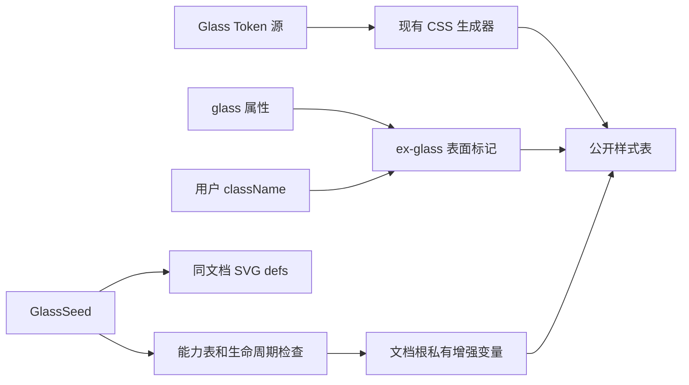

# RFC：ExUI Glass 材质与共享折射滤镜

日期：2026-09-20  
状态：Proposed；源设计已获用户确认，本文是工程细化提案，尚未实现或通过浏览器验收。  
模块根目录：`.notes/glass-effects/`  
源设计：[Glass 材质设计](../specs/2026-09-20-glass-effects-design.md)。源文件保留原文，其审批状态以本次交接记录为准。

## 1. 决策摘要

公开无参数的 `GlassSeed`，并在源设计指定的 42 个表面组件上提供 `glass?: boolean`。布尔属性与 `ex-glass` class 使用同一套 CSS；组件只负责消费属性、语义标记和必要的内部槽位映射。普通 HTML 元素通过 className 直接使用基础材质。

材质参数加入现有三主题 Token 管线，继续通过单一公共包发布。基础背景模糊默认可用；共享 Seed 只在已验证的浏览器能力范围内启用 SVG 折射。未知环境维持不含 SVG URL 的基础滤镜链，避免增强失败连带破坏基础模糊。

不增加 Provider、全局 DOM 扫描、逐元素副本、Canvas、动画循环或 Ant Design 依赖。现有普通组件外观、DOM 结构和交互职责不变。

## 2. 事实、约束与证据

### 2.1 仓库事实

- [公共组件边界](../../../.ai/architectures/components/public-surface.md)：根入口为 `packages/components/src/index.ts`，完整样式入口为 `src/index.css`，React 19 是宿主依赖。
- [Token 生成管线](../../../.ai/architectures/tokens/token-pipeline.md)：`ThemeTokens` 的分组递归生成 `--exui-*` 变量；light、dark、pitchBlack 形状一致，产物深冻结且保持 ESM/CJS 一致。
- [generate-css.mjs](../../../packages/tokens/scripts/generate-css.mjs) 已遍历各主题分组；新增 `glass` 后自然得到 `--exui-glass-*`，不另写第二套主题样式。
- [颜色校验](../../../packages/tokens/scripts/color-contrast-policy.mjs) 当前检查主题里的 `*Foreground` 配对和配方状态。它不会自动遍历一个任意嵌套的 Glass 状态组，需增加明确入口，不能以“原校验通过”代替 Glass 对比度验证。
- Button 等组件同时使用直接 `box-shadow` 配方和 Tailwind ring/shadow；InputGroup 把焦点与错误状态画在外层。通用 Glass 不能覆盖掉这些状态。
- Alert 的当前 DOM 不输出 variant；要支持 className 入口下的危险语义，必须补充明确语义属性，不能通过类名中包含 `text-destructive` 来猜测。
- Showcase 固定 Playwright `1.62.1`、Vitest Browser Mode，并有桌面与移动视口；移动视口不是移动浏览器引擎验证。见 [配置](../../../packages/showcase/vitest.config.ts)。
- 实施与交付遵守 [TESTING.md](../../../TESTING.md) 和 [CONTRIBUTING.md](../../../CONTRIBUTING.md)。

### 2.2 浏览器事实与推论

[CSS Filter Effects Level 2 编辑草案](https://drafts.csswg.org/filter-effects-2/#BackdropFilterProperty) 定义背景滤镜先处理背后图像，再绘制自身内容。非 none 的背景滤镜也会产生层叠上下文和绝对/固定定位后代的包含块。这说明：无需对文字施加 filter，但不能承诺 Glass 容器里的任意 fixed 后代仍以视口定位。该文档是编辑草案，实际效果仍需浏览器验证。

[WebKit 问题 317059](https://bugs.webkit.org/show_bug.cgi?id=317059) 记录含 URL 的背景滤镜链被整体丢弃；[问题 245510](https://bugs.webkit.org/show_bug.cgi?id=245510) 跟踪 SVG 背景滤镜实现差异。因此本 RFC 不把 `CSS.supports` 或一条 CSS URL 声明视为渲染成功，也不采用“先写 blur，再写 blur + url，浏览器自然回退”的方案。

工程推论：在禁止截图探测和额外渲染层的约束下，首版使用随实测结果维护的保守能力表。它是经过验证后才启用的发布数据，不是按浏览器名称猜测支持。更新后暂未验证的浏览器版本可能只显示基础毛玻璃，这是明确的兼容性取舍。

## 3. 范围与公共接口

### 3.1 公共接口

以下为拟新增契约，不是现有实现：

```ts
export function GlassSeed(): React.ReactElement

// 合并到下表各组件的现有 props，不进行 React DOM 全局类型扩展。
type GlassSurfaceProps = {
  glass?: boolean
}
```

`GlassSurfaceProps` 为包内复用类型，不新增必须由消费者导入的公共类型。`GlassSeed` 不接受 children、滤镜参数或自定义 ID。每个 Document 由宿主挂载一个 Seed；iframe 各自挂载，多 Seed 和 Shadow DOM 自动共享不在范围内。

`glass` 默认 false；精确的 `ex-glass` class token 始终启用材质，故 `glass={false}` 不抵消显式 class。`ex-glass-foo` 不算启用。不得把 glass 传给 DOM 或第三方 Root。

### 3.2 42 个显式入口与源码映射

下列路径均相对 `packages/components/src/components/ui/`：

| 文件 | 新增 glass 的导出 |
| --- | --- |
| `button.tsx` | Button、ActionButton |
| `toggle.tsx` / `toggle-group.tsx` | Toggle、ToggleGroupItem |
| `badge.tsx` | Badge |
| `card.tsx` / `alert.tsx` / `item.tsx` / `attachment.tsx` | Card、Alert、Item、Attachment |
| `bubble.tsx` | Bubble、BubbleContent、BubbleReactions |
| `input.tsx` / `textarea.tsx` / `input-group.tsx` | Input、Textarea、InputGroup |
| `native-select.tsx` | NativeSelect |
| `select.tsx` | SelectTrigger、SelectContent |
| `combobox.tsx` | ComboboxInput、ComboboxContent、ComboboxChips、ComboboxChip |
| `dialog.tsx` / `alert-dialog.tsx` / `sheet.tsx` / `drawer.tsx` | DialogContent、AlertDialogContent、SheetContent、DrawerContent |
| `popover.tsx` / `hover-card.tsx` / `tooltip.tsx` | PopoverContent、HoverCardContent、TooltipContent |
| `dropdown-menu.tsx` | DropdownMenuContent、DropdownMenuSubContent |
| `context-menu.tsx` | ContextMenuContent、ContextMenuSubContent |
| `menubar.tsx` | Menubar、MenubarContent、MenubarSubContent |
| `command.tsx` | Command、CommandDialog |
| `sidebar.tsx` | Sidebar、SidebarInset |
| `tabs.tsx` | TabsList、TabsTrigger |

现有派生 Button 包装组件继续透传。实现时沿 `React.ComponentProps<typeof Button>` 等类型检查接入，确保类型和实际落点一致。其他组件仅提供原有 className 接入，不扩大清单。

保留现有 variants、尺寸、`asChild` / `render`、事件、ref 和 ARIA 行为。`buttonVariants` 等公开配方函数不新增 glass 选项；它们生成的元素仍可另加 `ex-glass`。

## 4. 模块结构和控制流

拟新增文件：

| 文件 | 单一职责 |
| --- | --- |
| `packages/components/src/components/glass-seed.tsx` | 静态 SVG 定义及 Seed 生命周期 |
| `packages/components/src/lib/glass.ts` | 内部 props 类型、精确 class token 识别和特殊表面标记迁移 |
| `packages/components/src/lib/glass-capabilities.ts` | 无副作用的环境判定与已验证能力表；不在导入时读 navigator |
| `packages/components/src/glass.css` | 普通材质、状态、语义变体和有限槽位适配 |
| `packages/tokens/scripts/glass-policy.mjs` | 纯 Token 校验，输出失败列表 |
| `packages/showcase/src/showcase/Glass.vrt.test.tsx` | 公开产物的契约和渲染验证 |

根入口显式导出 GlassSeed；`src/index.css` 导入 `./glass.css`，打包进现有 `style.css`。组件根不因导入模块就修改页面状态。



CSS 变量是主题与增强的传递机制，不通过 React Context 传递材质。属性辅助函数不读取浏览器、不遍历或克隆 children。

## 5. Seed 与增强资格

### 5.1 DOM 和滤镜链

Seed 输出带 `aria-hidden="true"`、`focusable="false"` 的零尺寸 SVG，以绝对定位使其不占布局，禁止指针事件。不使用 `display: none` 隐藏滤镜定义。保留 ID `exui-glass-distortion-v1`。

拟采用的静态滤镜：

1. `filterUnits="objectBoundingBox"`、`primitiveUnits="userSpaceOnUse"`、区域 `x="-20%" y="-20%" width="140%" height="140%"`、`colorInterpolationFilters="sRGB"`。
2. `feTurbulence`：`type="fractalNoise"`、`baseFrequency="0.008 0.008"`、`numOctaves="2"`、`seed="92"`、`result="noise"`。
3. `feGaussianBlur`：`in="noise"`、`stdDeviation="2"`、`result="smooth-noise"`。
4. `feDisplacementMap`：`in="SourceGraphic"`、`in2="smooth-noise"`、`scale="8"`、`xChannelSelector="R"`、`yChannelSelector="G"`、`result="distorted"`。

以上数值是本 RFC 选择的初始算法参数，不是参考项目中已验证的视觉结果。最终输出为 displaced backdrop；基础模糊位于 CSS 链，不再追加参考项目的第二次整图模糊。参数非公共 API，允许在同一视觉目标内根据真实边缘与折射验收调整，记录调整依据。

### 5.2 基础和增强链

```css
/* 契约示意：完整状态与选择器按后文落实。 */
.ex-glass {
  -webkit-backdrop-filter:
    blur(var(--exui-glass-blur))
    saturate(var(--exui-glass-saturation))
    var(--_exui-glass-reference, brightness(1));
  backdrop-filter:
    blur(var(--exui-glass-blur))
    saturate(var(--exui-glass-saturation))
    var(--_exui-glass-reference, brightness(1));
}
```

缺少 Seed 或资格时，链中只有 CSS 函数，末尾 `brightness(1)` 是恒等操作；绝不先放入一个缺失或未经验证的 URL 再期待浏览器保留 blur。

### 5.3 生命周期

Seed 使用稳定的 React 19 callback ref 获取 SVG 的 `ownerDocument` 和其 `defaultView`，在 ref 附着后的提交阶段进行资格判断，不在 render 读取环境。合格后在该 Document 的 documentElement 上设置私有 `--_exui-glass-reference: url("#exui-glass-distortion-v1")`。

ref 注册记录变量原值与 priority，并返回 cleanup；ref 分离时同步撤回本实例设置并恢复原状态，不等待 passive effect。Strict Mode 的 setup/cleanup/setup 必须可重复。异步能力读取带取消标记，已取消的注册不得写回根变量。这使用 [React 19 的 ref cleanup 契约](https://react.dev/reference/react-dom/components/common#ref-callback)，且必须通过卸载时逐帧检查验证无失效引用的可见帧。外部脚本强行删除 Seed 的 DOM 不属于支持生命周期。

私有变量由库保留，消费者不直接修改。无外部存储、服务请求或 MutationObserver。一个普通玻璃元素卸载不会变更 Seed 或文档变量。

### 5.4 能力表与默认退化

`glass-capabilities.ts` 的表项结构包含：`engine`、`platform`、`major`、实际验证的完整浏览器版本与测试证据标识。首版 engine 仅考虑 Chromium，platform 仅收录实际完成验证的操作系统。数据随源代码审阅，不通过网络更新。

资格规则全部满足才开启：

1. 浏览器接受基础滤镜与目标 URL 链的 CSS 语法；这只是必要条件。
2. 从 UA Client Hints 的 Chromium brand/version/platform 或可明确解析的 Chromium 桌面 UA 获取引擎主版本和平台。忽略 GREASE brand；UA-CH 优先。iOS 变体、未知 WebView、无法解析或数据冲突一律不匹配。
3. 引擎主版本和平台在已通过真实渲染验证的能力表中。
4. Seed ref 仍连接在目标 Document，且本次注册未取消。

能力表使用主版本作为发布维护粒度；验证证据必须记录完整版本，不宣称同主版本所有补丁已逐一测试。已收录版本的后续补丁回归通过移除该主版本表项止损。未收录的新主版本自动回到基础毛玻璃，不放开未来版本范围。

首个能力表项由实施时实际运行的 pinned Chromium 版本及平台确定，不能在此文档凭空指定一个已通过版本。验证流程先在隔离测试夹具中强制测试候选滤镜链，确认基础与增强均成功，再把候选版本加入表，最后通过公开 GlassSeed 复测完整路径。生产包不提供强制增强开关；不能靠伪造 UA 或修改表让测试假装成功。

无合格表项的开发构建可仅显示基础效果，但不满足 Glass 增强功能的发布验收；首个功能版本必须至少有一个实测通过的平台/版本表项。其他平台继续基础效果，文档列出实际支持范围。浏览器版本升级时重复验证并更新记录。

这不是安全边界；伪造 UA 或宿主自行修改私有变量不在自动退化保证内。无运行时像素探测，不声称能检测任意驱动或浏览器补丁的渲染故障。

## 6. Token 数据与默认值

在 `ThemeTokens` 上新增必需分组 `glass: GlassTokens`，从 tokens 入口导出其类型。该新增字段使手写完整 ThemeTokens 的消费者需要补充配置，应在发布说明中明确，而不能称所有 TypeScript 用法均无迁移。

```ts
interface GlassInteractionTokens {
  readonly hoverBackground: string
  readonly activeBackground: string
  readonly selectedBackground: string
}

interface GlassDangerTokens extends GlassInteractionTokens {
  readonly background: string
  readonly foreground: string
  readonly border: string
  readonly fallbackBackground: string
}

interface GlassTokens extends GlassInteractionTokens {
  readonly background: string
  readonly foreground: string
  readonly border: string
  readonly shadow: string
  readonly blur: string
  readonly saturation: number
  readonly fallbackBackground: string
  readonly danger: GlassDangerTokens
}
```

主题中的字段由现有递归生成器产生 `--exui-glass-*`；嵌套 danger 对应 `--exui-glass-danger-*`。不增加 `componentRecipes.glass`，避免同一材质出现两份源数据。

### 6.1 中性材质初始值

| 字段 | light | dark | pitchBlack |
| --- | --- | --- | --- |
| background | `rgba(255, 255, 255, 0.72)` | `rgba(24, 24, 24, 0.72)` | `rgba(0, 0, 0, 0.78)` |
| foreground | 对应主题 `text.primary` | 对应主题 `text.primary` | 对应主题 `text.primary` |
| border | `rgba(0, 0, 0, 0.12)` | `rgba(255, 255, 255, 0.16)` | `rgba(255, 255, 255, 0.18)` |
| hoverBackground | `rgba(255, 255, 255, 0.82)` | `rgba(38, 38, 38, 0.82)` | `rgba(20, 20, 20, 0.86)` |
| activeBackground | `rgba(235, 235, 235, 0.90)` | `rgba(50, 50, 50, 0.90)` | `rgba(32, 32, 32, 0.92)` |
| selectedBackground | 与 activeBackground 相同 | 与 activeBackground 相同 | 与 activeBackground 相同 |
| fallbackBackground | `#ffffff` | `#181818` | `#000000` |
| blur | `0.5rem` | `0.5rem` | `0.5rem` |
| saturation | `1.2` | `1.2` | `1.2` |

shadow 统一使用 `inset 0 0 0 0.0625rem <主题 border>`。它是不会改变盒尺寸的边缘，不新增外投影。Token 源可通过纯函数从同一 border 值构造字符串；CSS 生成时发出 `inset 0 0 0 0.0625rem var(--exui-glass-border)`，使消费者覆盖边缘色继续有效。

foreground 的 JS 值由同主题语义值派生；生成 CSS 使用 `var(--exui-text-primary)`，保持语义覆盖传导。增加对应引用校验，不能只在 JS 上复用值而让 CSS 退回硬编码。

### 6.2 危险材质

危险色基础取当前主题 `control.danger`，前景取 `control.dangerForeground`。按基础 RGB 构造 rgba，default / hover / active / selected 的 alpha 分别为 `0.90 / 0.94 / 0.98 / 0.98`；边缘与不支持模糊时的背景使用不透明 danger 色。

JS 源通过明确的颜色构造函数生成 rgba；CSS 映射可使用 `color-mix(in srgb, var(--exui-control-danger) <alpha-percent>, transparent)` 保持对源语义色覆盖的响应。生成器对此组采用明确映射，JS 色彩校验仍使用实际 rgba 数值。所有上述状态必须通过对比度校验，不能以更强透明度为由放行失败值。

危险材质用于危险按钮、Badge、Alert、Bubble 等已带危险语义的表面；其他任意业务反馈色不自动重写。

### 6.3 校验扩展

- 三主题有相同 Glass 叶子集合；颜色可解析，数值有限，saturation 为正；内建 blur 与边缘长度使用 rem。
- `glass-policy.mjs` 遍历 neutral / danger 的基础、hover、active、selected 和 fallback 前景配对。沿用项目 4.5:1 文本门槛，测试背景合成到主题 surface.background，并补黑白两端背景样例；disabled 沿用现有豁免，不建立虚假的任意背景保证。
- 生成 CSS 中 semantic 引用和六个基础公开变量完整；ESM/CJS 和深冻结校验覆盖新增分组。
- 用内存副本构造缺字段、非法数值、坏引用和低对比度样例；不为通过测试而放宽已有所有 Token 的规则。

## 7. CSS 层叠、状态与阴影

### 7.1 表面规则

`glass.css` 的材质背景、前景、边缘色与 backdrop-filter 使用限定到 `.ex-glass` 的无 layer 规则，使其稳定覆盖组件内 Tailwind utility 配方。不能依赖调用方 class 字符串顺序。

仅设置材质属性，不写 display、position、z-index、宽高、padding、gap、圆角、overflow 或 pointer-events。不对后代统一设置 color。普通元素新增的视觉边缘来自 inset shadow，不给没有 border 的 div 增加实体边框宽度。

允许消费者通过公开 CSS 变量定制。显式 inline style 与正常层叠下更高优先级的用户 CSS 仍有最终控制权；不使用通用 `!important`。任意用户手写 box-shadow 由正常 CSS 层叠决定，不在运行时解析和重组。

### 7.2 状态矩阵

普通静态 div 不因鼠标经过就表现成按钮。库内用 `data-exui-glass-interactive` 标出已有交互表面；表单组合使用专门槽位匹配。

| 维度 | 行为 |
| --- | --- |
| default | 基础 background / foreground |
| hover | 仅交互表面使用 hoverBackground |
| selected / checked / pressed / expanded | 与原控件同义的状态标记使用 selectedBackground，保持勾选或活动指示 |
| active | 已启用交互表面的按下状态使用 activeBackground |
| focus-visible / focus-within | 不将玻璃恢复成不透明原底色；保留原控件焦点边缘与 ring |
| invalid | 保留错误边缘/ring；与 focus 共存时，沿用原组件错误优先规则 |
| disabled | 不响应 hover/active 材质切换，保留原 opacity 和不可交互行为 |

背景优先顺序是 active > selected > hover > default，disabled 屏蔽交互分支。focus 与 invalid 是独立边缘/阴影维度，不清除 selected 背景。匹配 `data-disabled` 时区分空字符串/true 与 false，不能用单纯属性存在判断禁用。

加入 `data-exui-glass-tone="danger"` 以统一识别危险语义，值由现有 variant 决定，不反向推断 class。语义标记即使 glass=false 也可存在，从而普通消费者事后添加 ex-glass 仍能工作。自定义未知组件上的 ex-glass 默认中性，不通过分析 children 推断危险色。

### 7.3 阴影合成

Glass 增加内阴影，保留原有投影和 ring。对直接写入 recipe `box-shadow` 的组件，补同状态的私有 `--_exui-glass-host-shadow` 赋值；对边框同理记录 `--_exui-glass-host-border`。这些伴随变量在非 Glass 模式不改变渲染。

Glass 的最终 box-shadow 按 Tailwind 当前组合方式保留 `--tw-inset-shadow`、`--tw-inset-ring-shadow`、`--tw-ring-offset-shadow`、`--tw-ring-shadow`，外投影取 `--_exui-glass-host-shadow`，未定义时取 `--tw-shadow`，最后附加材质内阴影。不存在的项用 `0 0 #0000`，不能把 `none` 放入逗号分隔阴影列表；源配方为 none 时由适配层规范化为透明零阴影。

焦点和错误状态更新 host-shadow/host-border，玻璃只增加内边缘，不重新计算整套控件交互。没有 recipe 的 Tailwind 控件继续由现有 ring 变量表现。实现时必须检查 Tailwind 生成的真实阴影表达式，保证组合顺序一致。

在 `@layer base` 对每个实际 Glass 表面设置本地 host-shadow 默认值，取自身 `--tw-shadow`，缺少时取透明零值；recipe 的 utility 层伴随变量可以覆盖此默认值。状态边缘的默认值同样在本地重置，只有 focus/invalid 分支使用 host-border，常态继续使用材质边缘。Bubble 的委托表面也列入重置选择器。Token 变量允许继承，单个表面的运行态变量不应从父玻璃表面泄漏；不能把重置写到优先级高于 utility 的无 layer 块中。

### 7.4 原有特殊效果

ComboboxContent 现有 before backdrop 层，仅在自身开启 Glass 时停用。菜单 Content 等若同样已有独立材质层，也遵循这一规则，逐文件检查而非全局清除 before/after。

Tooltip 箭头不新增滤镜，颜色跟随表面当前底色；必要时仅调整箭头原有背景/fill。普通子元素背景不被自动清除。

## 8. 组合组件的实现契约

内部辅助函数以空白分词精确识别 `ex-glass`。对于普通组件，只合并标记；对于表面迁移组件，从原 className 提取这一枚标记，保留其他 class，不在两个层级重复添加。

| 组件 | 具体处理 |
| --- | --- |
| Bubble | 根标记改为 `data-exui-glass-delegate="bubble"`；用直接子选择器把材质应用于自身 BubbleContent。BubbleContent 的 ex-glass 与委托选择器共用同一规则，合并为一次绘制。根上不绘制玻璃，不跨层传播 |
| InputGroup | 标记放在外层；内部 InputGroupInput/Textarea 保留已有透明和清除阴影规则；不自动给 addon 按钮添加标记 |
| ComboboxInput | 消费 glass 后传给外层 InputGroup；原 className 继续位于该外层，不把 glass 传给 Base UI Input |
| NativeSelect | 原 className 的非标记部分留在 wrapper；ex-glass 放在 select，自身状态与 border/ring 继续生效；系统选项列表不改 |
| Sidebar | none 分支放在当前表面；desktop 分支放在 sidebar-inner；mobile 分支放在 SheetContent。原 className 的布局用途仍留在原落点，移动分支只修复 Glass 标记丢失，不借机改变其他样式行为 |
| CommandDialog | 消费 glass，不传给 Dialog Root；在 DialogContent 设置表面标记及命令对话框专属标记。只使未独立开启 Glass 的直属 Command 默认底色透明，不触及任意深层业务节点 |
| Command | 单独使用时标记自身；直属 CommandDialog 中若显式 glass / ex-glass，则保留其独立嵌套表面，不被透明适配清除 |
| TabsList / TabsTrigger | 各自独立开启。列表 glass 不强制所有 Trigger 开启；保留既有活动指示，包括 line 变体的指示结构 |
| 其余 Portal Content | 材质放实际 Content，而不是 Root、Positioner 或 Overlay。原有定位、碰撞检测和焦点管理继续工作 |

对于支持 props 为函数式 className 的底层组件，保持其原类型：在库既有 className 解析点处理已求值字符串，不将函数 stringify。不要缩窄原有第三方公开 props 以便实现标记识别。

## 9. 降级、SSR 与使用边界

- 无 Seed、资格读取异常、未收录浏览器、Seed 卸载：删除增强引用，保留 CSS blur/saturate 链。
- `@supports` 显示标准和前缀基础 backdrop-filter 均不可用时：背景切换为相应 fallbackBackground；前景仍匹配主题/危险语义。可保留交互指示，但不能又用半透明 hover 背景覆盖 fallback。
- CSS style.css 未导入是宿主接入错误；Seed 不注入完整样式，也不自动替代 CSS 导入。
- SSR 输出静态 SVG 和组件标记；hydration 的客户端 ref 注册取得资格后才启用增强。服务端 HTML 只有基础材质；异步资格确认时发生的基础到增强变化是预期的渐进变化。
- Portal 共享 ownerDocument 的滤镜。主题依赖真实 DOM 继承；局部主题跨 Portal 时由宿主使用现有容器能力解决。
- 根增强变量可能被嵌套消费表面继承，但不改变是否开启标记。类标记不继承。
- backdrop-filter 的原生包含块和层叠上下文语义必须在使用文档说明。不要把依赖视口定位的任意非 Portal fixed 内容包进 Glass 后仍宣称其坐标关系无变化；这是背景滤镜固有边界，不通过额外布局机制规避。
- 保留用户已有 clipping 和 overflow；嵌套滤镜按浏览器 Backdrop Root 语义渲染，不承诺穿透任意祖先效果采样页面底层。

## 10. 验证与发布门禁

### 10.1 Token 与类型

新增 `packages/tokens/scripts/glass-policy.test.mjs`，复用 Node 测试约定；校验形状、数值、生成变量、语义引用和前景对比度。同步验证 ThemeTokens 新字段的类型导出。

隔离消费者对 42 个入口编译正向用例，并以类型负向用例验证 glass 非布尔值、DOM div 的 glass 和 GlassSeed children 被拒绝。包装控件、asChild、ref 和既有变体继续严格类型检查，禁止通过 any 或 skipLibCheck 绕过。

### 10.2 渲染与行为

`Glass.vrt.test.tsx` 只导入公开组件包，先完成 workspace build。参数化挂载清单内表面，验证标记、落点和无 DOM 属性泄漏。特殊组合逐项覆盖第 8 节，包括 Sidebar desktop / mobile / none。

三主题下对 Button、危险 Button、Card、自定义 div、InputGroup、Bubble、CommandDialog、Tooltip、菜单和 Sidebar 做代表性视觉验证。检查 focus、invalid、disabled、active、selected/pressed 的真实交互，不能只在 DOM 上伪造 class 来代替全部行为。

无 Seed、Strict Mode、卸载/重挂、同文档 Portal、SSR/hydration、两层嵌套、未知能力与基础滤镜缺失各有独立用例。能力判定纯函数的失败路径使用注入环境数据测试；真实增强必须由实际浏览器验证，不以模拟判定代替。

### 10.3 折射证据

使用固定种子的 SVG 噪声及固定背景：大色块、细网格、斜线、背景文字。分别捕获无滤镜、仅基础、增强状态。以无内容区域比较几何位移，另以组件自身文字区域验证清晰度；避免将一次 alpha 变化误判为折射。

测试需检查 SVG 定义存在、链引用正确和最终像素差异，但任何单项均不足以证明增强成功。对候选环境的失败不允许通过更新基线把无效果接受成有效增强。测试固定等待字体加载与界面稳定，不引入随机动画。

能力表记录实际通过的引擎版本和平台，与测试产物关联；验证脚本拒绝没有证据的新表项。移动视口仅证明响应式 Sidebar 分支，不给 Android/iOS 增强资格。

### 10.4 真实包与命令

扩展现有 packed-consumer gates：tarball 导入 GlassSeed，运行 SSR 和生产构建；在隔离消费者真实浏览器中验证一个自定义 div、Button、Portal Dialog 及缺 Seed 的基础路径。保留 tokens-only npm/pnpm 安装门禁。

实施后运行：

```text
pnpm tokens:check
pnpm typecheck
pnpm lint
pnpm build
pnpm test:visual
pnpm verify:pack
node skills/exui-usage/scripts/update.mjs --self-test
node skills/exui-usage/scripts/update.mjs --check
node skills/exui-usage/scripts/verify-examples.mjs
git diff --check
```

新能力表证据检查接入既有视觉/打包门禁，并在 TESTING.md 说明，不创建一个 CI 不会执行的孤立脚本。实际 tarball 保留供检视。

当前 RFC 阶段上述实现检查均为 NOT_EXECUTED。完成标准是相关命令通过、非 Glass 基线不变、至少一项真实增强环境通过；其他浏览器结果单列，不推定跨引擎通过。

## 11. 依赖、落地次序与回退

依赖按顺序推进，作为一个 Glass 功能交付，不提前发布半成品 API：

1. 在测试夹具验证修正后的滤镜链与保守资格机制。若无法得到可靠增强，停止后续扩散，报告与源设计的冲突。
2. 加入 Token 类型、三主题数据、生成器映射及验证。先保证数据和 CSS 契约一致。
3. 加入内部 Glass 模块、公开 Seed、共享样式及普通 div/Button 的完整纵向验收。
4. 接入完整清单及特殊表面映射，补状态与回归验证。
5. 更新 Showcase、消费者文档和使用技能示例，完成真实打包与视觉门禁。
6. 为公共包添加 Changeset。新增组件能力属于新增 API，同时明确 ThemeTokens 的字段迁移；最终版本级别遵循届时仓库发布规则和当前包版本，不在设计阶段修改版本。

消费方不使用 Glass 时无需改 JSX。手写完整 ThemeTokens 的消费者需要补 glass 分组，可从对应内建主题的 glass 值开始覆盖。消费者通过已公开的样式入口获得新能力，不增加安装依赖。

紧急回退增强可移除能力表项并发布补丁，保留基础材质和公共 props。完整功能回退由消费者移除 glass/ex-glass 并移除 Seed，或固定先前包版本。已发布后的破坏性删除不通过补丁静默实施。无持久化数据迁移或服务部署。

## 12. 风险、替代方案和未决事项

| 风险 | 处理与发现方式 |
| --- | --- |
| URL 链破坏 blur | 未经验证不放入链；候选环境真实像素测试；未知版本退回基础 |
| 能力表更新滞后 | 新版本仍有基础效果；跟随 Playwright/浏览器升级做资格验证，不放开无限未来版本 |
| 同主版本补丁回归 | 表项记录精确样本版本；新故障删除资格并补充重现；不宣称运行时检测所有渲染错误 |
| Token 前景和新背景冲突 | 专门 Glass 状态对比度检查，三主题与极端背景视觉样例 |
| 阴影或焦点丢失 | 明确 host-shadow/ring 合成；状态用例检查前后计算值和图像 |
| 嵌套组件变量泄漏 | 各实际表面重置私有运行态变量；组合和嵌套回归测试 |
| NativeSelect / Sidebar 落点错误 | 专门槽位映射与各分支真实浏览器检查 |
| fixed 后代坐标改变 | 明确原生背景滤镜边界，浮层沿用 Portal；不引入假透明副本规避 |
| 大面积、多层滤镜开销 | 保持静态、按需开启；不自动给所有后代应用，文档限制推荐使用范围 |

替代方案：纯 CSS 无法达到已确认的折射目标；原样复制参考项目带入布局与无效滤镜链；伪元素/新增包裹层无法统一覆盖原生输入和任意 className 表面且增加定位耦合；运行时截图探测或全局 Canvas 超出确认范围。采用显式表面、单链与实测资格表的方案。

没有等待用户决定的产品范围问题，没有占位值。实际滤镜观感、初次合格环境和性能是实施阶段必须提供的验证证据，当前不宣称已通过；失败时不得把它们藏为发布后工作。

本文完成 brainstorming 的 RFC 交接，不授权开始实现、提交、发布或把设计自动沉淀到 `.ai/`。
